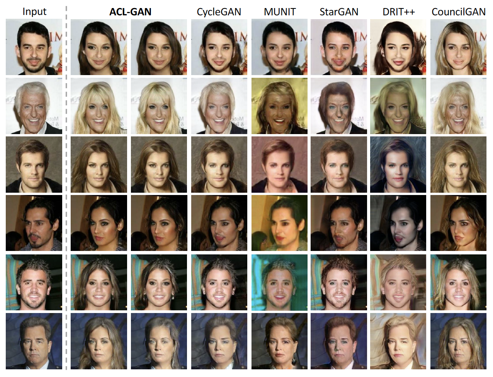
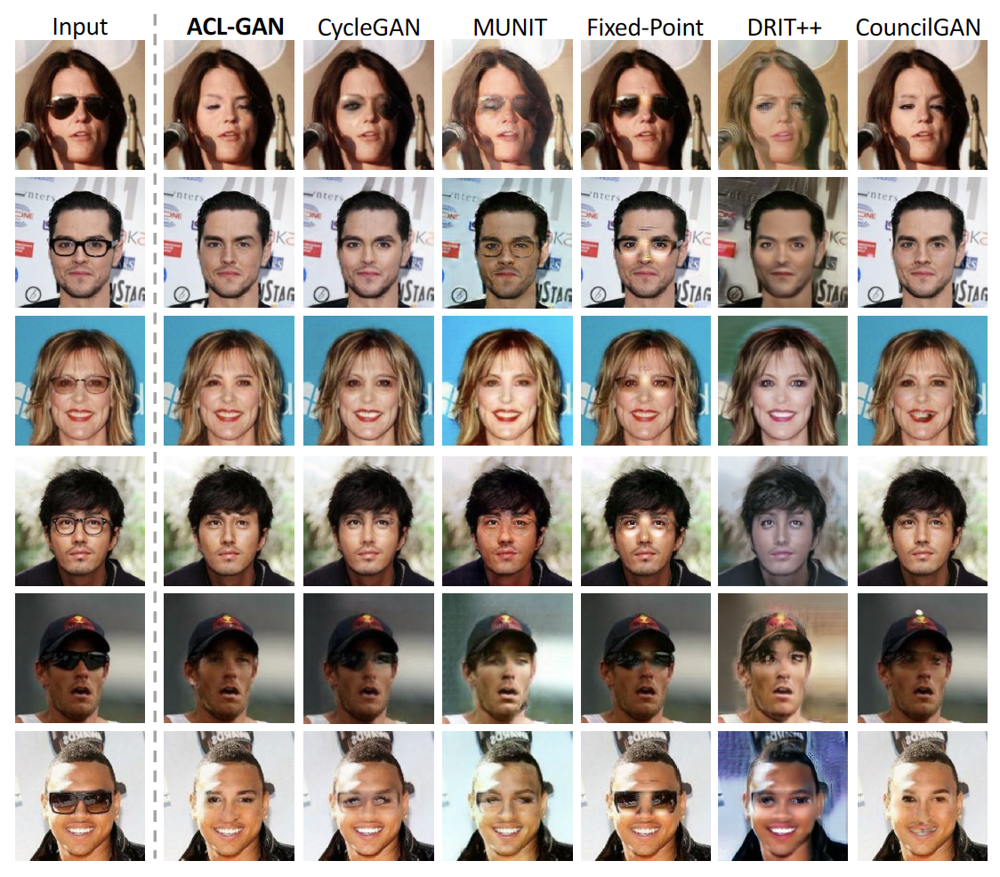
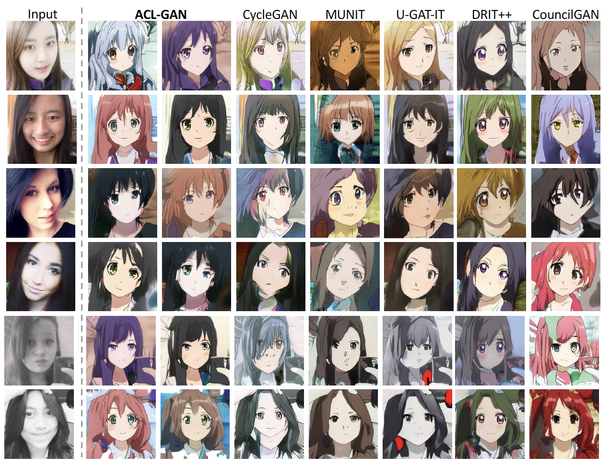

### Paper

Yihao Zhao, Ruihai Wu, Hao Dong, ["Unpaired Image-to-Image Translation using Adversarial Consistency Loss"](https://arxiv.org/abs/2003.04858 ), ECCV 2020

[arXiv](https://arxiv.org/abs/2003.04858) 

[project page](https://rivendile.github.io/ACL-GAN/)

### Code usage

For environment: 

`conda env create -f acl-gan.yaml`

For dataset: The dataset should be stored in the following format:

\dataset

| &nbsp;&nbsp;&nbsp; \train

| &nbsp;&nbsp;&nbsp; | &nbsp;&nbsp;&nbsp; \trainA

| &nbsp; &nbsp;&nbsp;| &nbsp;&nbsp;&nbsp; \trainB

| &nbsp;&nbsp;&nbsp; \test

| &nbsp;&nbsp;&nbsp; | &nbsp;&nbsp;&nbsp; \testA

| &nbsp;&nbsp;&nbsp; | &nbsp;&nbsp;&nbsp; \testB

For training: 

`python train.py --config configs/male2female.yaml`

For test: 

`python test.py --config configs/male2female.yaml --input inputs/test_male.jpg --checkpoint ./models/test.pth` 

### Experimental Results

##### Ablation study


##### Male-to-female



##### Glasses Removal



##### Selfie-to-anime



For more results, please refer to our paper.


### Citation

If you find this code useful for your research, please cite our paper:

```
@inproceedings{zhao2020aclgan,
  title={Unpaired Image-to-Image Translation using Adversarial Consistency Loss},
  author={Zhao, Yihao and Wu, Ruihai and Dong, Hao},
  booktitle={ECCV},
  year={2020}
}
```


